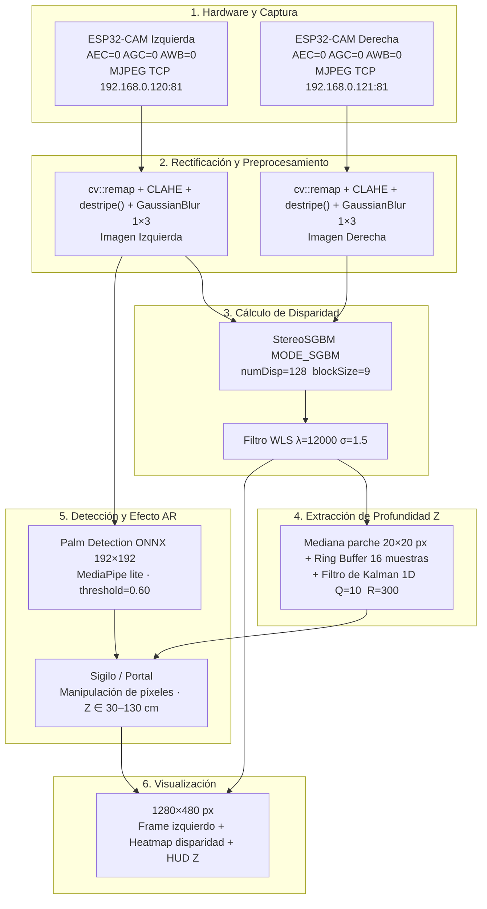

# Guía de Estudio — Pipeline de Visión Estereoscópica AR

---

## 1. Arquitectura general del sistema



---

## 2. Hardware — ESP32-CAM

El ESP32-CAM es una placa de desarrollo de bajo costo (~5 USD) que integra un microcontrolador ESP32, una cámara OV2640 y Wi-Fi. En este proyecto se configuran dos unidades como un par estéreo separados aproximadamente 8 cm horizontalmente.

La cámara se configura con **exposición automática desactivada (AEC=0), ganancia automática desactivada (AGC=0) y balance de blancos desactivado (AWB=0)**. Esto es crítico para visión estéreo: si cada cámara ajusta su exposición de forma independiente, el mismo objeto tiene brillo diferente en la imagen izquierda y derecha, lo que hace que el algoritmo de matching falle porque busca píxeles de igual intensidad. Al fijar estos parámetros, ambas cámaras producen imágenes fotométricamente consistentes.

La transmisión se realiza en formato **MJPEG sobre TCP** (no HTTP estándar). El programa mantiene un hilo de captura por cámara que lee bytes del socket, identifica el inicio de cada frame JPEG (bytes 0xFF 0xD8) y su fin (bytes 0xFF 0xD9), y decodifica la imagen con `cv::imdecode`. Este hilo se reconecta automáticamente si la conexión se interrumpe.

Para el procesamiento estéreo, el main loop solo trabaja con un par de frames si la diferencia de tiempo entre ambos es menor a 250 ms. Si los frames no están sincronizados, el mapa de disparidad sería incorrecto porque los objetos habrán cambiado de posición entre una toma y otra.

---

## 3. Preprocesamiento

El preprocesamiento busca un objetivo: mejorar la calidad de las imágenes antes del matching estéreo para obtener un mapa de disparidad más denso y preciso. Se aplican cuatro operaciones en secuencia.

### 3.1 Rectificación — cv::remap

La rectificación es el paso más importante del preprocesamiento. Usando los parámetros calculados en la calibración (matrices K, dist, R, T), `cv::stereoRectify` calcula mapas de transformación que, al aplicarse con `cv::remap`, producen imágenes donde los píxeles correspondientes entre la cámara izquierda y derecha quedan exactamente en la misma fila horizontal. Esto se llama alineación epipolar.

Sin rectificación, StereoSGBM tendría que buscar correspondencias en toda la imagen 2D, lo cual sería computacionalmente inviable y muy impreciso. Con rectificación, el problema se reduce a una búsqueda 1D horizontal, que es lo que el algoritmo asume.

La calidad de la rectificación depende directamente de la calidad de la calibración. Si la calibración es mala (ángulo de rotación grande entre cámaras, desplazamiento vertical), la rectificación no puede compensarlo completamente y las líneas epipolares quedan levemente desalineadas, lo que produce disparidades ruidosas.

### 3.2 CLAHE — Contrast Limited Adaptive Histogram Equalization

CLAHE mejora el contraste local de la imagen. A diferencia de la ecualización de histograma global (que aplica la misma transformación a toda la imagen), CLAHE divide la imagen en tiles de 8×8 píxeles y aplica la ecualización localmente en cada uno, con un límite de amplificación (`clipLimit=3`) para evitar amplificar el ruido en zonas homogéneas.

El efecto práctico es que las texturas en zonas oscuras se vuelven visibles sin sobreexponer las zonas brillantes. Más texturas visibles significa más puntos de correspondencia para StereoSGBM, lo que produce un mapa de disparidad más denso (menos huecos negros).

### 3.3 destripe() — Ecualización por fila

El sensor del ESP32-CAM con ganancia fija produce bandas horizontales de brillo desigual: algunas filas salen levemente más brillantes y otras más oscuras. `destripe()` corrige esto calculando la media de intensidad de cada fila, comparándola con la media global, y escalando los píxeles de esa fila con un factor k = globalMean / rowMean, clampeado entre 0.70 y 1.43 para evitar correcciones extremas.

Este es un ejemplo claro de **manipulación directa de píxeles**: la función accede a cada elemento del array de imagen y modifica su valor mediante operaciones aritméticas, sin usar ninguna función de alto nivel de OpenCV.

### 3.4 Ecualización inter-cámaras

Aunque ambas cámaras tienen exposición fija, pueden tener sensibilidades ligeramente distintas y producir imágenes con brillo global diferente. El código calcula la media de intensidad de cada imagen y aplica un factor de escala a la imagen derecha para igualarla a la izquierda:

```cpp
Scalar ml = mean(left), mr = mean(right);
right.convertTo(right, CV_8U, ml[0] / mr[0]);
```

### 3.5 GaussianBlur 1×3

Un suavizado gaussiano con kernel 1×3 (solo horizontal) atenúa el ruido de columna del sensor sin borrar los bordes verticales. Los bordes verticales son los más útiles para el matching estéreo horizontal, así que se preservan. El σ=0.8 es suave, suficiente para reducir ruido de alta frecuencia sin degradar el detalle.

---

## 4. Cálculo de disparidad

### StereoSGBM — Semi-Global Block Matching

StereoSGBM es el algoritmo central del sistema. Su función es encontrar, para cada píxel de la imagen izquierda, cuál es el píxel correspondiente en la imagen derecha (el mismo punto físico del mundo) y calcular el desplazamiento horizontal entre ellos: eso es la disparidad.

El algoritmo trabaja así: para un píxel (x, y) de la imagen izquierda, busca en la imagen derecha a lo largo de la misma fila y buscando el bloque de `blockSize × blockSize` píxeles que más se parezca al bloque centrado en (x, y). La diferencia horizontal es la disparidad d. La profundidad Z se calcula luego con Z = f·B/d.

La diferencia entre SGBM y el Block Matching simple (BM) es que SGBM aplica una optimización de energía a lo largo de múltiples caminos diagonales en la imagen. Esto produce mapas más densos (menos huecos) y más consistentes en superficies homogéneas (paredes, mesas) donde el BM simple falla completamente porque no encuentra texturas únicas para hacer el matching.

**Parámetros importantes:**
- **numDisp**: cuántos píxeles de desplazamiento puede buscar el algoritmo. Más alto = puede ver objetos más cercanos, pero más lento. A 128 numDisp con f=270 y B=98mm, puede detectar objetos desde unos 20cm hasta infinito.
- **blockSize**: el tamaño del bloque de comparación. Más pequeño (3-5) = más detalle pero más ruido. Más grande (11-21) = más suave pero pierde detalle fino.
- **P1 y P2**: penalizaciones por cambios de disparidad. P1 penaliza cambios de ±1 (gradientes suaves). P2 penaliza cambios mayores (saltos bruscos). La relación P2 > P1 fuerza que la disparidad varíe suavemente.

### Filtro WLS — Weighted Least Squares

Después de StereoSGBM, los bordes de los objetos suelen tener disparidades incorrectas. Esto ocurre por oclusión: en los bordes, un lado de la cámara ve algo que el otro lado no puede ver (está tapado por el propio objeto). WLS corrige esto usando la imagen de color original como guía.

El filtro aplica una regularización que suaviza la disparidad pero respeta los bordes de la imagen original (bordes de color = bordes de disparidad). Los parámetros λ=12000 (suavidad global) y σ=1.5 (sensibilidad a bordes de color) se ajustaron empíricamente para este sistema.

El resultado es un mapa de disparidad más limpio, con bordes definidos y menos huecos, lo que mejora directamente la estimación de Z.

---

## 5. Estimación de profundidad Z

### Fórmula de profundidad estéreo

La relación entre disparidad y profundidad es:

```
Z = f · B / d

Donde:
  f = distancia focal en píxeles  (~270 px en este sistema)
  B = baseline (separación entre cámaras) en mm  (~98 mm)
  d = disparidad en píxeles (valor del mapa / 16, porque SGBM usa fixed-point ×16)
```

Esta fórmula viene de geometría proyectiva: dos cámaras viendo el mismo punto a distancia Z producen un desplazamiento horizontal de f·B/Z píxeles entre las dos imágenes. Despejando Z, se obtiene la fórmula.

La medición se toma en el **parche central de 20×20 píxeles** del mapa de disparidad (donde apunta el crosshair verde). Se calcula la mediana del parche en lugar del promedio para descartar outliers.

### Ring Buffer de 16 muestras

El valor de disparidad en el centro del frame varía frame a frame incluso para objetos estáticos, debido al ruido del sensor y variaciones de iluminación. Un ring buffer guarda las últimas 16 mediciones de Z_raw y calcula su mediana. Esto elimina outliers individuales sin introducir el retraso que causaría un promedio simple con muchas muestras.

### Filtro de Kalman 1D

El filtro de Kalman modela Z como un estado que evoluciona en el tiempo con ruido de proceso Q=10 y se mide con ruido de medición R=300. En cada frame:

1. **Predicción**: el filtro asume que Z no cambió mucho desde el frame anterior (modelo de velocidad constante).
2. **Corrección**: combina la predicción con la nueva medición según la relación Q/R. Como R >> Q, el filtro confía más en su predicción propia que en cada medición individual.

El resultado es Z_filt, una estimación suave y estable que no salta bruscamente entre frames. Es esta estimación la que controla la intensidad del efecto AR.

**Z_raw vs Z_filt:** Z_raw es la medición directa de ese frame, ruidosa. Z_filt es el resultado del Kalman, suave. Si acercas la mano rápidamente, Z_raw reacciona antes; Z_filt sigue con un pequeño retraso pero sin fluctuaciones.

---

## 6. Detección de mano — HandTracker

### Arquitectura del modelo

Se usa el modelo **palm_detection_lite** de MediaPipe, convertido a formato ONNX para correr con el módulo DNN de OpenCV. El modelo recibe imágenes de 192×192 píxeles en formato NCHW (canales primero, formato que espera OpenCV DNN) con píxeles normalizados entre 0 y 1 y canal RGB.

La arquitectura interna es un detector SSD (Single Shot Detector) con anchors predefinidas. El modelo tiene 2016 anchors distribuidas en la imagen:
- Grid de 24×24 con 2 anchors por celda (stride 8) = 1152 anchors para objetos grandes
- Grid de 12×12 con 6 anchors por celda (stride 16) = 864 anchors para objetos pequeños

Para cada anchor, el modelo produce 18 valores: coordenadas del bounding box (cx, cy, w, h) más 7 keypoints de la palma, y un score de confianza.

### Decodificación de detecciones

El score que sale del modelo es un logit crudo (puede ser cualquier valor real). Se aplica la función sigmoide para convertirlo a probabilidad [0, 1]:

```
score = 1 / (1 + exp(-logit))
```

Solo se aceptan detecciones con score > 0.60 (umbral configurable). Las coordenadas se decodifican como:

```
cx = (anchor_cx + reg[0] / 192) * imgW
cy = (anchor_cy + reg[1] / 192) * imgH
w  = (reg[2] / 192) * imgW
```

Después se aplica NMS (Non-Maximum Suppression) con umbral IoU=0.30 para eliminar detecciones duplicadas del mismo objeto.

### Por qué no se usa el modelo de landmarks

El pipeline original usaba también un modelo de 21 keypoints (hand_landmark.onnx) para detectar las articulaciones de los dedos. Se descartó porque cuando el bounding box de la palma detectada es pequeño (< 50px en alguna dimensión), el crop que se pasa al modelo de landmarks es demasiado pequeño y las coordenadas de los keypoints salen todas agrupadas en un área incorrecta. El modelo es frágil ante ROIs de baja resolución.

La solución fue derivar el centro y radio de la palma directamente del bounding box del palm detector, que es más robusto:

```
palmCenter = {cx, cy}
radiusPx   = max(40, min(max(w,h) * 0.55, 200))
```

---

## 7. Efecto AR — Manipulación de píxeles

### Por qué pixel manipulation y no funciones de alto nivel

El enunciado del proyecto requiere que el efecto visual se realice mediante manipulación de píxeles. Las funciones como `cv::circle`, `cv::line` y `cv::polylines` son funciones de alto nivel que dibujan internamente usando Bresenham o Wu's line algorithm encapsulado. No cuentan como manipulación de píxeles.

La implementación actual dibuja **todo** el sigilo iterando sobre cada píxel de la región de interés y calculando si ese píxel pertenece a cada forma geométrica mediante matemáticas de distancia:

- **Círculos concéntricos**: un píxel pertenece al anillo si `|distancia_al_centro - radio| ≤ halfwidth`. Se aplica un fade de 1 pixel en el borde para anti-aliasing.
- **Líneas radiales**: para cada uno de los 12 rayos, se precomputan los endpoints y se calcula la distancia mínima del píxel al segmento de línea. Si dist < 1.5px, se pinta.
- **Triángulo y hexágono**: mismo método — distancia del píxel a cada segmento del polígono.
- **Glow central**: gradiente radial — si d < glowR, intensidad = 1 - d/glowR.
- **Partículas orbitales**: asignación directa de valor RGB: `row[nx] = cv::Vec3b(0, bright, 255)`.
- **Compositing alfa**: loop explícito `dst[c] = α·src[c] + (1−α)·dst[c]`.

### Z → Intensidad del efecto

El parámetro `intensity` controla simultáneamente el tamaño, la velocidad de rotación, el brillo y la opacidad del sigilo:

```
Z ∈ [30cm, 130cm]
intensity = 1.0 - (Z - 30) / 100     (normalizado a [0, 1])
intensity = max(0.5, intensity)        (mínimo 0.5 para siempre ser visible)

alpha  = 0.22 + intensity * 0.58      (opacidad del blend)
bright = 150  + intensity * 105       (valor verde del color naranja)
ringW  = 2    + intensity * 4         (grosor de los anillos)
radius = max(75, radiusPx * (1.15 + intensity * 0.50))
angleDeg += 2.5 + intensity * 5.0    (velocidad de rotación por frame)
```

En resumen: más cerca = sigilo más grande, más brillante, más rápido y más opaco.

### Portal entre dos manos

Cuando se detectan dos palmas simultáneamente, además de los dos sigilos individuales, se dibuja un portal entre ellas usando `drawPortal()`. El centro del portal es el punto medio entre las dos palmas, y el radio es el 45% de la distancia de separación entre ellas. El portal rota en sentido contrario al sigilo (`-angleDeg`) creando un efecto visual de energía opuesta.

---

## 8. Estado de la calibración actual

La calibración es el talón de Aquiles del sistema. Una calibración incorrecta afecta todo: la rectificación falla, el mapa de disparidad es ruidoso e inestable, y los valores de Z son incorrectos.

### Qué significan los parámetros del archivo YML

**K_l y K_r (matrices de cámara intrínsecas):** Describen las propiedades ópticas de cada cámara individualmente. Los valores de la diagonal son la distancia focal en píxeles (fx ≈ 270, fy ≈ 277 para la izquierda). El tercer elemento de cada fila es el punto principal (donde el eje óptico cruza el sensor, idealmente el centro de la imagen: cx≈160, cy≈126 para una imagen de 320×240).

**dist_l y dist_r (coeficientes de distorsión):** Describen cómo la lente deforma la imagen. Los primeros dos (k1, k2) son distorsión radial (barril o cojín). Los dos siguientes (p1, p2) son distorsión tangencial. El quinto (k3) es corrección radial de orden superior. Valores grandes indican lente muy distorsionada (como en el ESP32-CAM).

**R (matriz de rotación):** Describe el ángulo entre las dos cámaras. Idealmente es la matriz identidad (cámaras perfectamente paralelas). Si hay valores significativos fuera de la diagonal, las cámaras están rotadas entre sí.

**T (vector de traslación):** Describe la posición de la cámara derecha respecto a la izquierda. Para una configuración estéreo horizontal ideal, debería ser `T = [80, 0, 0]` mm (solo separación horizontal). Si T[1] (vertical) es grande, las cámaras están a diferente altura.

### Análisis comparativo de las dos calibraciones

| Métrica | Calibración anterior | Calibración actual | Ideal |
|---|---|---|---|
| Ángulo de rotación entre cámaras | 22.2° | **24.0°** | < 2° |
| Desplazamiento vertical T\[1\] | −127 mm | **+83 mm** | ~0 mm |
| Baseline horizontal \|T\[0\]\| | 55 mm | 50 mm | ~80 mm |
| Baseline norm(T) usado en código | 138.6 mm | 97.8 mm | ~80 mm |
| Factor de inflación de Z | 1.73× | **1.22×** | 1.0× |

La calibración actual es levemente mejor en el baseline (138→97mm, más cerca del real 80mm) pero empeoró en el ángulo de rotación (22°→24°). El desplazamiento vertical sigue siendo grande. La consecuencia práctica es que con la calibración actual, si el sistema muestra Z=30cm, la distancia real es aproximadamente 30/1.22 ≈ 24.5cm.

### Por qué es tan difícil calibrar bien el ESP32-CAM

1. **Lentes de baja calidad**: los coeficientes de distorsión son grandes (k3=0.49 para la izquierda, 0.66 para la derecha), lo que significa que las lentes tienen distorsión alta y los coeficientes de orden superior son necesarios pero hacen la calibración más sensible al ruido.

2. **Resolución baja**: con imágenes de 320×240, cada píxel representa más espacio real, lo que amplifica los errores de localización de esquinas del tablero.

3. **Ausencia de montaje rígido**: si las cámaras no están perfectamente fijas durante la captura de pares para calibración, los parámetros R y T reflejarán posiciones promediadas que no corresponden a ninguna posición real.

### Cómo mejorar la calibración

Para obtener una calibración correcta se necesita:
- Cámaras físicamente alineadas: misma altura, mismo ángulo de mira, separación puramente horizontal.
- Mínimo 15-20 pares de imágenes del tablero capturados simultáneamente.
- El tablero debe variar en posición y orientación: cerca, lejos, esquina izquierda, esquina derecha, inclinado 30°, inclinado al otro lado, arriba, abajo.
- El tablero debe verse completo en ambas cámaras en cada captura.
- Verificar que R quede cercana a identidad y T[1] quede cercano a 0 antes de usar la calibración.

---

## 9. Glosario rápido

| Término | Definición |
|---|---|
| Disparidad | Diferencia horizontal en píxeles entre dónde aparece un punto en la cámara izquierda vs la derecha |
| Baseline | Separación física entre los centros ópticos de las dos cámaras |
| Rectificación | Transformación que alinea las filas de ambas imágenes para que las correspondencias sean horizontales |
| Epipolares | Líneas en la imagen donde deben estar los puntos correspondientes después de la rectificación |
| Anchor (SSD) | Caja predefinida en una posición y escala específica de la imagen; el modelo predice ajustes sobre ella |
| NMS | Non-Maximum Suppression — elimina detecciones duplicadas manteniendo solo la de mayor score |
| NCHW | Formato de tensor: (batch, canales, alto, ancho) — requerido por OpenCV DNN |
| Sigmoide | Función 1/(1+e^−x) que convierte logits en probabilidades [0,1] |
| Kalman | Filtro bayesiano que combina predicción del modelo con medición ruidosa para estimar el estado |
| Ring Buffer | Buffer circular de tamaño fijo que descarta la muestra más antigua al agregar una nueva |
| WLS | Weighted Least Squares — mínimos cuadrados ponderados, usado para suavizar el mapa de disparidad guiado por bordes de color |
| CLAHE | Contrast Limited Adaptive Histogram Equalization — mejora contraste local con límite de amplificación |
| SGBM | Semi-Global Block Matching — variante de block matching con optimización a lo largo de múltiples direcciones |
