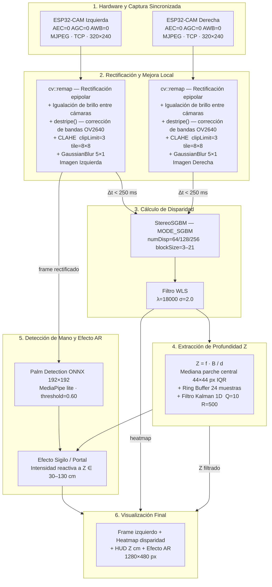

# Guión — Pipeline de Visión Estereoscópica con ESP32-CAM
> **Duración total:** 5 minutos — 4:30 explicación + 0:30 demo en vivo

---

## Diagrama del pipeline

---

## Guión

### 0:00 – 0:20 · Qué hace el sistema
> *[Programa corriendo: mano moviéndose, Z cambiando en HUD]*

"Dos cámaras de cinco dólares midiendo distancias en tiempo real. Sin sensores de distancia, sin infrarrojo, sin LiDAR. Solo geometría y filtros. El único número que nos importa al final es Z — la distancia en centímetros."

---

### 0:20 – 1:00 · Por qué dos cámaras
> *[Las dos imágenes lado a lado, señalar el mismo objeto desplazado]*

"Un objeto cercano aparece en posiciones distintas en la imagen izquierda y la derecha. Ese desplazamiento horizontal se llama disparidad, y es inversamente proporcional a la distancia:

**Z = focal × baseline / disparidad**

Con focal ≈ 299 px y baseline ≈ 82 mm, a 30 cm la disparidad es 82 px, a 130 cm es 19 px. El reto es medir esos píxeles de desplazamiento con precisión suficiente — y para eso existe todo lo que viene después."

---

### 1:00 – 2:00 · Rectificación y filtros — por qué cada uno
> *[Mostrar imagen antes/después de rectificación con líneas horizontales]*

"**Rectificación.** Las cámaras físicamente tienen 10° de rotación entre ellas por el montaje. StereoSGBM asume que el mismo punto está en la misma fila en ambas imágenes. Sin corregir esa rotación, el error vertical es de 44 píxeles y el algoritmo no puede operar. `cv::remap` lo baja a menos de 2 px usando los parámetros de calibración.

**Igualación de brillo.** Aunque los dos sensores están configurados igual, tienen respuestas distintas. Si una imagen es más brillante, el algoritmo compara valores distintos del mismo objeto y falla.

**Destripe.** El sensor OV2640 varía el brillo fila a fila. Sin corregirlo, StereoSGBM interpreta esas rayas como bordes horizontales reales y produce disparidades falsas en esas zonas.

**CLAHE.** En zonas oscuras o uniformes no hay textura visible. Sin textura, el algoritmo no encuentra correspondencias y deja huecos negros en el mapa. CLAHE amplifica el contraste local para revelar esas texturas sin sobreexponer las zonas brillantes.

**Blur 5×1.** Solo en horizontal, para no borrar los bordes verticales que el matching necesita para anclarse."

---

### 2:00 – 3:00 · SGBM y WLS — por qué cada uno
> *[Mostrar mapa de disparidad crudo vs filtrado WLS]*

"**StereoSGBM.** Prueba todos los desplazamientos posibles para cada píxel y elige el que produce menor diferencia entre los dos bloques. El 'Semi-Global' significa que evalúa no solo en horizontal sino en múltiples direcciones, lo que produce mapas mucho más densos que StereoBM clásico — menos huecos negros, más cobertura de la escena.

**Filtro WLS.** El mapa crudo tiene artefactos en los bordes: píxeles del fondo que heredan la disparidad del objeto de enfrente porque el bloque de comparación toca las dos zonas. WLS suaviza globalmente pero usa la imagen de color como guía: donde hay un borde de color, respeta ese borde de profundidad y no lo suaviza. El resultado son objetos con contornos limpios."

---

### 3:00 – 4:00 · Kalman — por qué
> *[Mostrar HUD: Z raw saltando vs Z filt estable]*

"Del mapa se extrae la mediana del parche central de 44×44 píxeles usando el rango intercuartílico para descartar outliers. Ese valor crudo varía ±5 cm entre frames aunque el objeto no se mueva — ruido del sensor, iluminación, cuantización de disparidad.

El **Ring Buffer de 24 muestras** acumula mediciones recientes y calcula la mediana IQR temporal para suavizar picos puntuales.

El **filtro Kalman** combina esa mediana con su propia predicción. Con Q=10 y R=500, la relación R/Q=50 le indica al filtro que confíe más en su predicción que en cada medición individual. El resultado es un Z estable que no oscila aunque el sensor entregue valores ruidosos."

---

### 4:00 – 4:30 · Cierre
"Cada etapa existe porque sin ella la siguiente falla. Sin rectificación no hay matching. Sin CLAHE el mapa tiene huecos. Sin WLS los bordes tienen artefactos. Sin Kalman el Z es inutilizable. Son decisiones encadenadas, no opcionales."

---

### 4:30 – 5:00 · Demo en vivo
> *[Mostrar el programa: acercar y alejar la mano, ver Z responder y el efecto AR cambiar de intensidad. Señalar el heatmap y el HUD.]*
