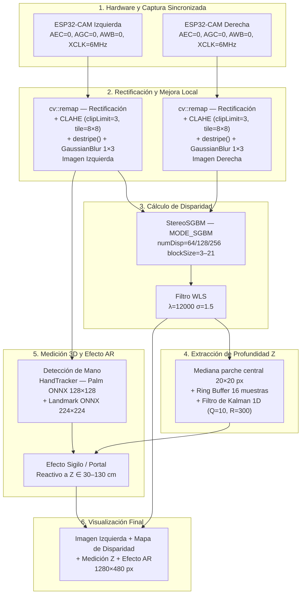

# Pipeline — Visión Estereoscópica

```mermaid
flowchart TD
    subgraph HW["1. Hardware y Captura Sincronizada"]
        L["ESP32-CAM Izquierda\nAEC=0, AGC=0, AWB=0, XCLK=6MHz"]
        R["ESP32-CAM Derecha\nAEC=0, AGC=0, AWB=0, XCLK=6MHz"]
    end

    subgraph PROC["2. Rectificación y Mejora Local"]
        RL["cv::remap — Rectificación\n+ CLAHE (clipLimit=3, tile=8×8)\n+ destripe() + GaussianBlur 1×3\nImagen Izquierda"]
        RR["cv::remap — Rectificación\n+ CLAHE (clipLimit=3, tile=8×8)\n+ destripe() + GaussianBlur 1×3\nImagen Derecha"]
    end

    subgraph DISP["3. Cálculo de Disparidad"]
        SGBM["StereoSGBM — MODE_SGBM\nnumDisp=64/128/256  blockSize=3–21"]
        WLS["Filtro WLS\nλ=12000  σ=1.5"]
    end

    subgraph DEPTH["4. Extracción de Profundidad Z"]
        D["Mediana parche central 20×20 px\n+ Ring Buffer 16 muestras\n+ Filtro de Kalman 1D (Q=10, R=300)"]
    end

    subgraph AR["5. Medición 3D y Efecto AR"]
        H["Detección de Mano\nHandTracker — Palm ONNX 128×128\n+ Landmark ONNX 224×224"]
        E["Efecto Sigilo / Portal\nReactivo a Z ∈ 30–130 cm"]
    end

    subgraph VIS["6. Visualización Final"]
        OUT["Imagen Izquierda + Mapa de Disparidad\n+ Medición Z + Efecto AR\n1280×480 px"]
    end

    L --> RL
    R --> RR
    RL --> SGBM
    RR --> SGBM
    SGBM --> WLS
    WLS --> D
    D --> E
    RL --> H
    H --> E
    E --> OUT
    WLS --> OUT
```
