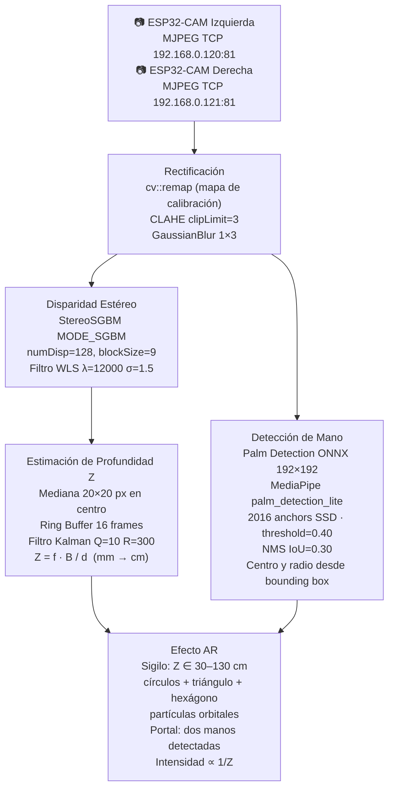

# Diagrama del Pipeline — Visión Estereoscópica AR

```mermaid
flowchart TD
    A["📷 ESP32-CAM Izquierda\nMJPEG TCP 192.168.0.120:81\n📷 ESP32-CAM Derecha\nMJPEG TCP 192.168.0.121:81"]

    B["Rectificación\ncv::remap (mapa de calibración)\nCLAHE clipLimit=3\nGaussianBlur 1×3"]

    C["Disparidad Estéreo\nStereoSGBM MODE_SGBM\nnumDisp=128, blockSize=9\nFiltro WLS λ=12000 σ=1.5"]

    D["Estimación de Profundidad Z\nMediana 20×20 px en centro\nRing Buffer 16 frames\nFiltro Kalman Q=10 R=300\nZ = f · B / d  (mm → cm)"]

    E["Detección de Mano\nPalm Detection ONNX 192×192\nMediaPipe palm_detection_lite\n2016 anchors SSD · threshold=0.40\nNMS IoU=0.30\nCentro y radio desde bounding box"]

    F["Efecto AR\nSigilo: Z ∈ 30–130 cm\ncírculos + triángulo + hexágono\npartículas orbitales\nPortal: dos manos detectadas\nIntensidad ∝ 1/Z"]

    A --> B
    B --> C
    C --> D
    B --> E
    D --> F
    E --> F
```
